# RainUSE Nexus

> **AI-powered prospecting engine for rainwater reuse opportunities across commercial buildings in the US.**

[][DEMO URL HERE]
[](https://rainuse-nexus-api.railway.app/docs)

---

## Live Demo

[DEMO URL HERE]

---

## Architecture

```mermaid
flowchart LR
    subgraph Sources["Satellite Signals + Open Datasets"]
        A1[Microsoft Building\nFootprints]
        A2[NOAA Precipitation\n& Cooling Degree Days]
        A3[EPA Facility Registry\n& FEMA Flood Zones]
        A4[WRI Aqueduct\nWater Stress]
        A5[EIA Water Tariffs\n& State Policy]
    end

    subgraph Pipeline["Python Pipeline"]
        B1[Ingest & Feature\nEngineering]
        B2[17-Factor Weighted\nScoring]
        B3[Claude AI Cooling-Tower\nConfidence Detection]
        B4[ESG & Stormwater\nIncentive Enrichment]
    end

    subgraph API["FastAPI Backend"]
        C1[GET /buildings\nfiltered + paginated]
        C2[GET /buildings/id\nfull detail]
        C3[GET /summary\nGET /states]
    end

    subgraph Dashboard["React Dashboard"]
        D1[Interactive Map\nLeaflet + color pins]
        D2[Building Explorer\n9-filter panel]
        D3[ROI Calculator\npayback + CO₂]
        D4[Score Breakdown\n5-pillar analysis]
    end

    Sources --> Pipeline
    Pipeline -->|buildings_scored.csv| API
    API -->|REST JSON| Dashboard
```



---

## Key Features

- **AI Cooling-Tower Confidence** — Claude AI (`claude-sonnet-4-20250514`) analyzes building attributes to estimate cooling infrastructure presence (0–100% confidence), the primary driver of industrial water demand.
- **17-Factor Viability Score** — weighted composite spanning roof geometry, NOAA rainfall, WRI water stress, FEMA flood risk, EPA facility context, local water rates, state policy, and ESG signals; each dimension auditable.
- **Interactive National Map** — 500+ buildings plotted as color-coded pins (green ≥ 70, amber 50–69, red < 50) with score-range slider, state filter, and click-to-inspect popups showing AI confidence + visual notes.
- **Per-Building ROI Calculator** — annual water-cost savings, payback period (assuming a $45K system), and CO₂ equivalent offset; driven by state water tariff rates.
- **ESG & Regulatory Signals** — stormwater fee schedule by state, LEED/ESG score stubs, and state policy index to surface regulatory tailwinds.
- **22-State Coverage** — entire Sun Belt and Southeast, the regions with the highest combination of rainfall volume, cooling demand, and water-cost pressure.

---

## Grundfos Challenge Alignment

| Grundfos Requirement | How RainUSE Nexus Meets It |
|---|---|
| Identify high-potential commercial rooftops | 500+ buildings ranked by 17-factor viability score across 22 states |
| Cooling tower / HVAC water reuse focus | Claude AI estimates cooling tower presence for every prospect; confidence score drives final rank |
| ROI / payback analysis | Per-building ROI calculator: annual savings, payback period, CO₂ offset |
| State-by-state prospecting | Interactive map + state selector; per-state aggregates via `/states` API |
| Regulatory & incentive context | State policy score, stormwater fee lookup, ESG enrichment per building |
| Scalable data pipeline | Python pipeline → FastAPI → React; offline fallback to bundled data |
| Roof size qualification (>100K sqft) | `roof_over_100k` flag on every record; ✅/❌ indicator in Building Explorer |

---

## Quick Start

**Step 1 — Run the backend**
```bash
cd backend
pip install -r requirements.txt
uvicorn app.main:app --reload --port 8000
# API docs → http://localhost:8000/docs
```

**Step 2 — Run the frontend**
```bash
cd frontend
cp .env.example .env.local   # sets VITE_API_URL=http://localhost:8000
npm install && npm run dev
# Dashboard → http://localhost:5173
```

**Step 3 — (Optional) Run AI cooling-tower detection**
```bash
export ANTHROPIC_API_KEY=sk-ant-...
python scripts/imagery/detect_cooling_towers.py
# Reads top 100 buildings, calls Claude, merges results into buildings_scored.csv
```

> **No backend?** The frontend ships with bundled demo data and works fully offline. The navbar shows a `DEMO MODE` badge when the live API is unreachable.

---

## Data Sources

| Dataset | Provider | Used For |
|---|---|---|
| Building Footprints | Microsoft / OpenStreetMap | Roof area, geometry, coordinates |
| Climate Normals | NOAA | Annual precipitation per location |
| Cooling Degree Days | NOAA | Regional mechanical-cooling load |
| Facility Registry System | U.S. EPA | Industrial facility context score |
| Flood Hazard Layers | FEMA | Flood risk / resilience signal |
| Aqueduct Water Risk Atlas | WRI | Baseline water stress per watershed |
| Water Tariff Data | EIA / State Utilities | Local water cost ($/kgal) |
| State Policy Index | NCEL / NCSL | Rainwater harvesting legal framework |
| AI Roof Assessment | Anthropic Claude | Cooling-tower confidence scoring |

---

## Project Structure

```
rainuse-nexus/
├── scripts/          # Data pipeline (ingest → features → scoring → export)
├── data/processed/   # Scored outputs consumed by the API
├── backend/          # FastAPI app (routes, services, Pydantic models)
└── frontend/         # React + Vite dashboard (Tailwind, Leaflet, Framer Motion)
```

## API Reference

| Endpoint | Description |
|---|---|
| `GET /buildings?state=Texas&limit=50` | Filtered building list |
| `GET /buildings/{id}` | Full building detail + scores |
| `GET /summary` | Dashboard KPIs |
| `GET /states` | Per-state aggregates |
